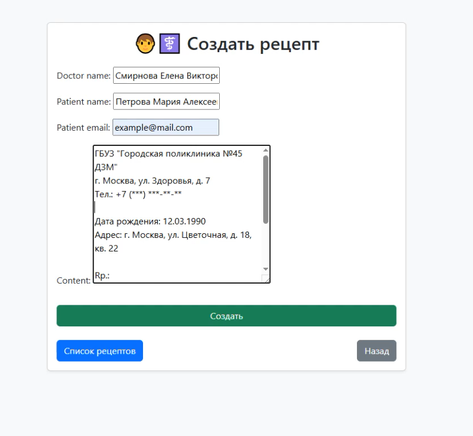
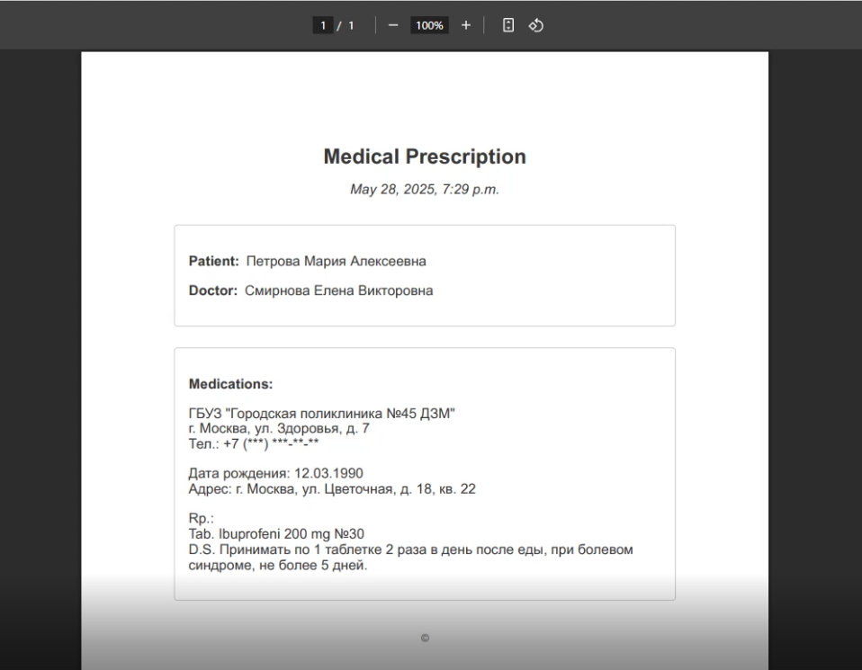

# 💊 Система электронных рецептов на Django

Это веб-приложение для управления медицинскими рецептами. Врачи могут создавать, просматривать и загружать рецепты в формате PDF. Подходит для использования в небольших медицинских учреждениях, а также как учебный проект для разработчиков.

## 🔧 Функциональность

- ✅ Создание рецепта (врач, пациент, email, описание)
- ✅ Просмотр списка рецептов
- ✅ Детальная страница рецепта
- ✅ Генерация и скачивание PDF с рецептом (WeasyPrint)
- ✅ Адаптивный интерфейс с Bootstrap 5

## 📸 Скриншоты

| Список рецептов | Рецепт в PDF |
|-----------------|--------------|
|  |  |

## ⚙️ Технологии

- Python 3.12+
- Django 4.x
- WeasyPrint
- Bootstrap 5
- HTML5, CSS3

## 🚀 Установка

1. **Клонировать репозиторий**
   ```bash
   git clone https://github.com/yourusername/prescription-system.git
   cd prescription-system

## 📄 Структура проекта
```commandline
   medproject/
│
├── prescriptions/       # Приложение с логикой рецептов
│   ├── templates/
│   │   └── prescriptions/
│   │       ├── create.html
│   │       ├── prescription_list.html
│   │       ├── prescription_detail.html
│   │       └── pdf.html
│   ├── models.py
│   ├── views.py
│   ├── forms.py
│   └── urls.py
│
├── medproject/          # Настройки Django
│   └── settings.py
├── manage.py
└── requirements.txt

```

## 📥 Экспорт в PDF
PDF генерируется с помощью шаблона pdf.html и библиотеки WeasyPrint. Содержит имя врача, пациента и описание рецепта.

🧑‍💻 Автор
Arslonbek Erkinov
GitHub: @CyberB0x

